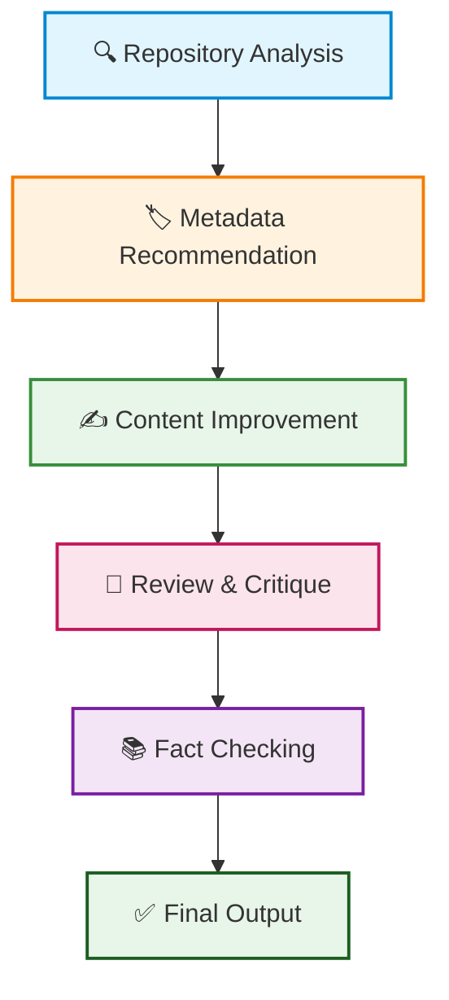

# Publication Assistant for AI Projects - Comprehensive End-to-End Documentation

## Table of Contents
1. [Project Overview](#project-overview)
2. [Architecture](#architecture)
3. [Project Structure](#project-structure)
4. [Core Components](#core-components)
5. [Security Features](#security-features)
6. [Resilience & Error Handling](#resilience--error-handling)
7. [User Interfaces](#user-interfaces)
8. [API Documentation](#api-documentation)
9. [Testing Framework](#testing-framework)
10. [Deployment Guide](#deployment-guide)
11. [Configuration](#configuration)
12. [Development Workflow](#development-workflow)

---

## Project Overview

**Publication Assistant for AI Projects** is a production-ready multi-agent system that analyzes GitHub repositories and automatically generates high-quality publication improvements. The system transforms repositories into polished documentation with improved READMEs, metadata, and discoverability features.

### Key Capabilities
- 🤖 **Multi-Agent AI System**: Specialized agents working collaboratively
- 📝 **Content Generation**: Automatic README rewriting and improvement
- 🏷️ **Metadata Enhancement**: Intelligent title, tag, and description generation
- 🔍 **Repository Analysis**: Deep code structure and documentation analysis
- ✅ **Fact Checking**: Verification of technical claims using academic sources
- 🎨 **Dual Interface**: Both Web UI and Gradio interfaces
- 🔒 **Security First**: Comprehensive security measures and validation
- 🛡️ **Resilience Patterns**: Circuit breakers, retries, and fallback mechanisms

### Technology Stack
- **Backend**: Python 3.11+, FastAPI, Uvicorn
- **AI/ML**: LangGraph, LangChain, Google GenAI, Groq
- **Vector Database**: ChromaDB (for RAG)
- **Web Search**: Tavily Python Client
- **Academic Verification**: ArXiv API
- **Frontend**: Gradio, Custom Web UI (HTML/JS/Tailwind)
- **Security**: JWT authentication, input validation, rate limiting
- **Testing**: Pytest, comprehensive test coverage

---

## Architecture

### System Architecture Diagram

```
┌─────────────────────────────────────────────────────────────┐
│                    USER INTERFACES                         │
├──────────────────────┬──────────────────────────────────────┤
│   Gradio UI          │   Web UI (HTML/JS/Tailwind)          │
│   (Port 7860-7862)   │   (Port 8009)                        │
└──────────┬───────────┴──────────────────┬───────────────────┘
           │                              │
           └──────────────┬───────────────┘
                          │
┌─────────────────────────▼──────────────────────────────────┐
│                  FASTAPI APPLICATION LAYER                  │
├────────────────────────────────────────────────────────────┤
│  • REST API Endpoints      • Security Middleware           │
│  • Authentication         • Rate Limiting                 │
│  • Request Validation     • Error Handling                 │
└────────────────────────────┬───────────────────────────────┘
                          │
┌─────────────────────────▼──────────────────────────────────┐
│              ORCHESTRATION LAYER (LangGraph)               │
├────────────────────────────────────────────────────────────┤
│  • Agent Coordination      • State Management               │
│  • Workflow Control       • Pipeline Execution             │
└────────────────────────────┬───────────────────────────────┘
                          │
┌─────────────────────────▼──────────────────────────────────┐
│                  AGENTS LAYER                               │
├────────────────────────────────────────────────────────────┤
│  RepoAnalyzer │ Metadata │ Content │ Reviewer │ FactChecker│
│  DeepAnalyzer │          │ Improver │ Critic   │ Comprehensive│
│  AdaptiveWriter │ SEOStrategy │ IntelligentContent │        │
└────────────────────────────┬───────────────────────────────┘
                          │
┌─────────────────────────▼──────────────────────────────────┐
│                    TOOLS LAYER                              │
├────────────────────────────────────────────────────────────┤
│  RepoParser │ WebSearch │ RAG │ Keyword │ Arxiv │ Context │
│  RepositoryGrounded │ Enrichment │                        │
└────────────────────────────┬───────────────────────────────┘
                          │
┌─────────────────────────▼──────────────────────────────────┐
│                EXTERNAL SERVICES                           │
├────────────────────────────────────────────────────────────┤
│  GitHub API │ Google AI │ Groq │ ChromaDB │ Tavily │ ArXiv │
└────────────────────────────────────────────────────────────┘
```

### Multi-Agent Orchestration Flow



---

## Project Structure

### Directory Structure

```
Publication Assistant for AI Projects/
├── agents/                          # AI Agent implementations
│   ├── __init__.py                 # Agent exports
│   ├── repo_analyzer.py            # Repository structure analysis
│   ├── metadata_recommender.py     # Title, tag, description generation
│   ├── content_improver.py         # README rewriting with RAG
│   ├── reviewer_critic.py          # Documentation quality scoring
│   ├── fact_checker.py             # Technical claim verification
│   ├── deep_repo_analyzer.py       # Enhanced repository analysis
│   ├── intelligent_content_improver.py  # Advanced content improvement
│   ├── comprehensive_fact_checker.py    # Enhanced fact checking
│   ├── adaptive_technical_writer.py     # Adaptive writing styles
│   └── seo_strategy_agent.py       # SEO optimization
│
├── orchestration/                   # Workflow orchestration
│   ├── __init__.py
│   ├── graph.py                    # LangGraph orchestration
│   └── collaborative_orchestrator.py  # Multi-agent collaboration
│
├── tools/                           # Tool implementations
│   ├── __init__.py
│   ├── repo_parser.py              # Repository parsing (local/remote/ZIP)
│   ├── web_search.py               # Web search integration
│   ├── keyword_extractor.py        # Keyword extraction
│   ├── rag_retriever.py            # RAG with ChromaDB
│   ├── arxiv_scholar.py            # Academic paper search
│   ├── context_enrichment.py       # Context enrichment tools
│   └── repository_grounded_generator.py  # Repository-grounded generation
│
├── security/                        # Security implementations
│   ├── __init__.py
│   ├── architecture.md             # Security architecture docs
│   ├── configs/                    # Configuration management
│   │   ├── config.py
│   │   ├── config_loader.py
│   │   └── .env.example
│   ├── filters/                    # Security filters
│   │   ├── attack_detection.py
│   │   ├── injection_filters.py
│   │   └── prompt_guard.py
│   ├── logging/                    # Security logging
│   │   └── logging_config.py
│   ├── middleware/                 # Security middleware
│   │   ├── auth_middleware.py
│   │   ├── rate_limit_middleware.py
│   │   ├── request_size_middleware.py
│   │   ├── security_headers_middleware.py
│   │   └── validation_middleware.py
│   ├── moderation/                 # Content moderation
│   │   └── output_guard.py
│   └── validators/                 # Input validation
│       ├── file_validators.py
│       ├── input_validators.py
│       ├── repo_validators.py
│       └── validators.py
│
├── resilience/                      # Resilience patterns
│   ├── __init__.py
│   ├── RESILIENCE.md               # Resilience documentation
│   ├── resilience_architecture.md  # Architecture docs
│   ├── workflow_recovery_design.md # Recovery design
│   ├── circuit_breaker/            # Circuit breaker pattern
│   ├── concurrency/                # Concurrency management
│   ├── fallback/                   # Fallback mechanisms
│   ├── retry/                      # Retry logic with backoff
│   ├── timeout/                    # Timeout management
│   ├── loop/                       # Loop detection
│   └── tests/                      # Resilience tests
│
├── utils/                           # Utility functions
│   ├── __init__.py
│   ├── dependency_container.py     # Dependency injection
│   ├── error_handler.py            # Centralized error handling
│   ├── evaluation.py               # Evaluation metrics
│   ├── logging.py                  # Logging configuration
│   ├── mcp.py                      # MCP communication
│   └── publication_builder.py      # Publication construction
│
├── ui/                              # User Interface files
│   ├── index.html                  # Landing page
│   ├── launcher.html               # Interface selection
│   ├── generate.html               # Main generation interface
│   ├── projects.html               # Project management
│   ├── history.html                # Generation history
│   ├── saved.html                  # Saved publications
│   ├── analytics.html              # Analytics dashboard
│   ├── settings.html               # Settings configuration
│   ├── help.html                   # Help documentation
│   ├── gradio-placeholder.html     # Gradio UI placeholder
│   ├── sidebar.html                # Shared sidebar component
│   ├── shared.js                   # Shared JavaScript utilities
│   └── sidebar-loader.js          # Sidebar loading logic
│
├── tests/                           # Test suite
│   ├── conftest.py                 # Test configuration
│   ├── compat_testclient.py        # Compatibility test client
│   ├── e2e/                        # End-to-end tests
│   ├── integration/                # Integration tests
│   ├── unit/                       # Unit tests
│   ├── performance/                # Performance tests
│   └── mocks/                      # Test mocks
│
├── assets/                          # Static assets
│   ├── favicon.ico
│   ├── hero_bg.png
│   ├── image.png
│   └── screenshots/
│
├── demo_sample_repo/               # Sample repository for testing
│   ├── README.md
│   └── run.py
│
├── .env.example                    # Environment variables template
├── .gitignore                      # Git ignore rules
├── .coveragerc                      # Coverage configuration
├── pytest.ini                      # Pytest configuration
├── Dockerfile                      # Docker container definition
├── LICENSE                         # License file
├── README.md                       # Project README
├── AGENTS.md                       # Agents documentation
├── requirements.txt                # Python dependencies
├── app.py                          # FastAPI application
├── main.py                         # CLI entry point
└── test_routes.py                  # Route testing
```

---

## Core Components

### 1. AI Agents

#### Original Agents
- **RepoAnalyzerAgent**: Analyzes repository structure, README, and code statistics
- **MetadataRecommenderAgent**: Suggests project titles, tags, and descriptions
- **ContentImproverAgent**: Rewrites README using RAG + web search
- **ReviewerCriticAgent**: Scores documentation quality and flags issues
- **FactCheckerAgent**: Verifies technical claims using arXiv

#### Enhanced Agents
- **DeepRepositoryAnalyzerAgent**: Enhanced repository analysis with deeper insights
- **IntelligentContentImproverAgent**: Advanced content improvement with context
- **ComprehensiveFactCheckerAgent**: Enhanced fact checking with multiple sources
- **AdaptiveTechnicalWriter**: Adaptive writing styles for different audiences
- **SEOStrategyAgent**: SEO optimization for discoverability

### 2. Tools

#### Core Tools
- **RepoParser**: Reads local, ZIP, or remote GitHub repositories
- **WebSearchTool**: Finds similar successful repositories using Tavily
- **KeywordExtractor**: Extracts technical keywords (Gemini/Heuristic)
- **RAGRetriever**: Retrieves best-practice documentation hints using ChromaDB
- **ArxivScholarTool**: Verifies scientific and technical claims

#### Enhanced Tools
- **ContextEnrichmentTool**: Enriches context with additional information
- **RepositoryGroundedGenerator**: Generates content grounded in repository evidence

### 3. Orchestration

#### Graph-based Orchestration
- **Orchestrator**: Main LangGraph orchestration logic
- **CollaborativeOrchestrator**: Multi-agent collaboration patterns

### 4. Utilities

- **DependencyContainer**: Dependency injection container
- **ErrorHandler**: Centralized error handling
- **PublicationBuilder**: Publication construction utilities
- **Evaluation**: Evaluation metrics and scoring

---

## Security Features

### Authentication & Authorization
- **JWT Authentication**: Token-based authentication system
- **Middleware**: AuthMiddleware for request authentication
- **Optional Auth**: Support for both required and optional authentication

### Input Validation
- **Repo Validators**: Comprehensive repository URL validation
- **File Validators**: Upload file validation and sanitization
- **Input Validators**: General input validation and sanitization
- **Dangerous Pattern Detection**: Protection against injection attacks

### Security Middleware
- **Rate Limiting**: Token bucket algorithm for rate limiting
- **Request Size**: Request size validation to prevent DoS
- **Security Headers**: HSTS, CSP, and other security headers
- **Validation**: Request validation middleware

### Content Moderation
- **Output Guard**: Content moderation and filtering
- **Attack Detection**: Detection of potential attacks
- **Injection Filters**: Protection against injection attacks
- **Prompt Guard**: Prompt injection protection

---

## Resilience & Error Handling

### Circuit Breaker Pattern
- **CircuitBreaker**: Automatic failure detection and recovery
- **Configurable Thresholds**: Customizable failure thresholds
- **Decorator Support**: Easy integration with decorators

### Retry Mechanisms
- **RetryManager**: Automatic retry with exponential backoff
- **Retry Policies**: Configurable retry strategies
- **Backoff**: Intelligent backoff strategies

### Timeout Management
- **TimeoutManager**: Request timeout management
- **Async Timeout Guard**: Async timeout protection
- **Timeout Middleware**: Global timeout enforcement

### Fallback Mechanisms
- **FallbackManager**: Graceful fallback handling
- **Loop Detection**: Workflow cycle detection
- **Iteration Management**: Control over iteration limits

---

## User Interfaces

### 1. Gradio UI
- **Port**: 7860-7862 (auto-incrementing)
- **Features**: 
  - Repository validation
  - Project configuration
  - Article generation
  - Progress tracking
  - Result display

### 2. Web UI
- **Port**: 8009
- **Features**:
  - Modern responsive design
  - Dark/light theme toggle
  - Project management
  - Generation history
  - Analytics dashboard
  - Settings configuration

### UI Pages
- **index.html**: Landing page with feature highlights
- **launcher.html**: Interface selection (Web UI vs Gradio)
- **generate.html**: Main generation interface
- **projects.html**: Project management
- **history.html**: Generation history
- **saved.html**: Saved publications
- **analytics.html**: Analytics dashboard
- **settings.html**: Settings configuration
- **help.html**: Help documentation

---

## API Documentation

### REST API Endpoints

#### Health & Status
- `GET /health` - Health check endpoint
- `GET /ready` - Readiness check
- `GET /live` - Liveness check

#### Generation
- `POST /api/generate` - Synchronous generation
- `POST /api/generate_async` - Asynchronous generation
- `GET /api/generate_status` - Generation status polling
- `POST /api/generate_cancel` - Cancel generation
- `GET /api/generate_result` - Get generation result

#### Validation
- `POST /api/validate` - Repository validation

#### Projects
- `GET /api/projects` - Get all projects
- `POST /api/projects` - Create project
- `DELETE /api/projects` - Delete project

#### Other
- `POST /api/upload` - File upload
- `GET /api/history` - Generation history
- `GET /api/saved` - Saved publications
- `GET /api/analytics` - Analytics data
- `GET /api/settings` - Settings
- `POST /api/settings` - Update settings
- `GET /api/help` - Help content
- `GET /api/about` - About information

### Model Configuration

#### Supported Models
- **Gemini 3.6 Flash (Google)**: Default model
- **Gemini 3.5 Flash (Google)**
- **Gemini 3.5 Flash-Lite (Google)**
- **Llama 4 Scout (Groq)**
- **Llama 4 Maverick (Groq)**
- **Heuristic Fallback (No LLM)**

#### Writing Styles
- **Technical Blog**: Technical blog post style
- **Academic Showcase**: Academic paper style
- **Executive Summary**: Executive summary style
- **User Guide**: User documentation style

#### Publication Length
- **Short**: Concise articles
- **Medium**: Standard length (default)
- **Long**: Comprehensive articles

---

## Testing Framework

### Test Structure
- **Unit Tests**: Individual component testing
- **Integration Tests**: Component integration testing
- **End-to-End Tests**: Full workflow testing
- **Performance Tests**: Performance and stress testing
- **Resilience Tests**: Circuit breaker and retry testing

### Test Coverage
- **Current Coverage**: ~16% (targeting 90%+)
- **Critical Modules**: High coverage priority
- **Security Components**: Comprehensive coverage

### Running Tests
```bash
# Run all tests
pytest

# Run specific test categories
pytest tests/unit/
pytest tests/integration/
pytest tests/e2e/

# Run with coverage
pytest --cov=.

# Run specific test file
pytest tests/test_agents.py
```

---

## Deployment Guide

### Local Development

#### Prerequisites
- Python 3.11+
- Google API Key (optional)
- Groq API Key (required)
- Tavily API Key (optional)

#### Installation
```bash
# Clone repository
git clone <repository-url>
cd publication-assistant

# Install dependencies
pip install -r requirements.txt

# Set up environment variables
cp .env.example .env
# Edit .env with your API keys

# Run Gradio UI
python app.py

# Run Web UI
python app.py --serve-ui --port 8009
```

### Docker Deployment

#### Build Docker Image
```bash
docker build -t publication-assistant .
```

#### Run Container
```bash
docker run -p 8009:8009 \
  -e GOOGLE_API_KEY=your_key \
  -e GROQ_API_KEY=your_key \
  publication-assistant
```

### Production Deployment

#### Environment Variables
```env
GOOGLE_API_KEY=your_google_api_key
GROQ_API_KEY=your_groq_api_key
TAVILY_API_KEY=your_tavily_api_key
JWT_SECRET=your_jwt_secret
SECRET_KEY=your_secret_key
APP_ENV=production
```

#### Security Considerations
- Use strong secrets for JWT_SECRET and SECRET_KEY
- Enable HTTPS in production
- Configure proper CORS origins
- Enable all security middleware
- Set up monitoring and logging

---

## Configuration

### Application Configuration

#### Model Configuration
```python
DEFAULT_MODEL_NAME = "Gemini 3.6 Flash (Google)"

MODEL_MAP = {
    "Gemini 3.6 Flash (Google)": ("google", "gemini-3.6-flash"),
    "Gemini 3.5 Flash (Google)": ("google", "gemini-3.5-flash"),
    "Gemini 3.5 Flash-Lite (Google)": ("google", "gemini-3.5-flash-lite"),
    "Llama 4 Scout (Groq)": ("groq", "meta-llama/llama-4-scout-17b-16e-instruct"),
    "Llama 4 Maverick (Groq)": ("groq", "meta-llama/llama-4-maverick-17b-128e-instruct"),
    "Heuristic Fallback (No LLM)": ("none", "heuristic"),
}
```

#### Server Configuration
```python
# Default ports
GRADIO_PORT = 7860
WEB_UI_PORT = 8009

# Timeouts
GENERATION_TIMEOUT = 90  # seconds
REQUEST_TIMEOUT = 30  # seconds
```

### Security Configuration

#### Rate Limiting
```python
RATE_LIMIT_REQUESTS = 100
RATE_LIMIT_WINDOW = 60  # seconds
```

#### File Upload
```python
MAX_FILE_SIZE = 20 * 1024 * 1024  # 20MB
ALLOWED_FILE_TYPES = ['application/pdf', 'application/vnd.openxmlformats-officedocument.wordprocessingml.document', 'text/plain']
```

---

## Development Workflow

### Code Structure Guidelines

#### Agent Development
1. Inherit from base agent classes
2. Implement required methods
3. Add proper error handling
4. Include comprehensive tests
5. Update documentation

#### Tool Development
1. Implement tool interface
2. Add graceful fallbacks
3. Include validation
4. Add logging
5. Write tests

#### API Development
1. Define Pydantic models
2. Implement validation
3. Add security middleware
4. Include error handling
5. Write integration tests

### Git Workflow

#### Branch Naming
- `feature/feature-name`
- `bugfix/bug-description`
- `hotfix/critical-fix`
- `refactor/code-improvement`

#### Commit Messages
```
type(scope): description

Examples:
feat(api): add new generation endpoint
fix(ui): resolve generate button issue
security(auth): strengthen JWT validation
docs(readme): update installation guide
```

### Testing Requirements

#### Before Committing
- Run unit tests: `pytest tests/unit/`
- Run integration tests: `pytest tests/integration/`
- Check code coverage: `pytest --cov=.`
- Manual UI testing

#### Before Merging
- All tests passing
- Code coverage maintained/increased
- Security review completed
- Documentation updated
- No breaking changes without deprecation

---

## Monitoring & Maintenance

### Health Checks
- **Health Endpoint**: `/health` - Overall system health
- **Readiness**: `/ready` - Ready to accept requests
- **Liveness**: `/live` - Process is running

### Logging
- **Structured Logging**: JSON format for production
- **Log Levels**: DEBUG, INFO, WARNING, ERROR, CRITICAL
- **Request Tracing**: Correlation IDs for distributed tracing

### Performance Monitoring
- **Response Times**: Track API response times
- **Error Rates**: Monitor error frequencies
- **Resource Usage**: CPU, memory, disk usage
- **Generation Times**: Track generation performance

---

## Troubleshooting

### Common Issues

#### Generation Failures
- **Issue**: Generation times out or fails
- **Solution**: Check API keys, increase timeout, check model availability

#### UI Not Loading
- **Issue**: Web UI or Gradio UI not accessible
- **Solution**: Check port availability, firewall settings, server logs

#### Memory Issues
- **Issue**: Out of memory errors
- **Solution**: Reduce batch size, increase system memory, use smaller models

#### Authentication Errors
- **Issue**: JWT authentication failures
- **Solution**: Check JWT_SECRET, token expiration, clock synchronization

### Debug Mode
```bash
# Enable debug logging
export LOG_LEVEL=DEBUG

# Run with debug mode
python app.py --serve-ui --port 8009 --debug
```

---

## Future Enhancements

### Planned Features
- [ ] Database abstraction layer
- [ ] Caching strategy for expensive operations
- [ ] Distributed tracing (OpenTelemetry)
- [ ] API versioning
- [ ] Advanced analytics dashboard
- [ ] Real-time collaboration features
- [ ] Multi-language support
- [ ] Advanced SEO features
- [ ] Integration with more LLM providers
- [ ] Mobile applications

### Technical Debt
- [ ] Increase test coverage to 90%+
- [ ] Add more integration tests
- [ ] Improve error messages
- [ ] Optimize database queries
- [ ] Refactor large functions
- [ ] Update dependencies

---

## Support & Contributing

### Getting Help
- **Documentation**: Check this comprehensive guide
- **Issues**: Report bugs via GitHub issues
- **Discussions**: Use GitHub discussions for questions
- **Support**: Contact development team for critical issues

### Contributing
1. Fork the repository
2. Create a feature branch
3. Make your changes
4. Add tests
5. Update documentation
6. Submit a pull request

### Code Review Process
1. Automated checks must pass
2. Code coverage maintained
3. Security review completed
4. Documentation updated
5. At least one approval required

---

## License

This project is licensed under the terms specified in the LICENSE file.

---

## Appendix

### A. API Key Setup
#### Google API Key
1. Go to Google Cloud Console
2. Create a new project
3. Enable Generative Language API
4. Create API credentials
5. Copy API key to `.env` file

#### Groq API Key
1. Go to Groq Console
2. Sign up/login
3. Create API key
4. Copy API key to `.env` file

#### Tavily API Key
1. Go to Tavily Console
2. Sign up/login
3. Create API key
4. Copy API key to `.env` file

### B. File Structure Details
#### Configuration Files
- `.env.example`: Environment variables template
- `pytest.ini`: Pytest configuration
- `.coveragerc`: Coverage configuration
- `Dockerfile`: Docker container definition

#### Documentation Files
- `README.md`: Project overview
- `AGENTS.md`: Agents documentation
- `COMPREHENSIVE_DOCUMENTATION.md`: This file
- `security/architecture.md`: Security architecture
- `resilience/RESILIENCE.md`: Resilience patterns

### C. Performance Benchmarks
#### Generation Times
- **Small Repository**: ~30-60 seconds
- **Medium Repository**: ~60-120 seconds
- **Large Repository**: ~120-300 seconds

#### API Response Times
- **Health Check**: <100ms
- **Validation**: ~1-3 seconds
- **Generation Start**: <500ms
- **Status Poll**: <200ms

---

*This documentation is maintained as part of the Publication Assistant for AI Projects project. For the most up-to-date information, please refer to the project repository.*